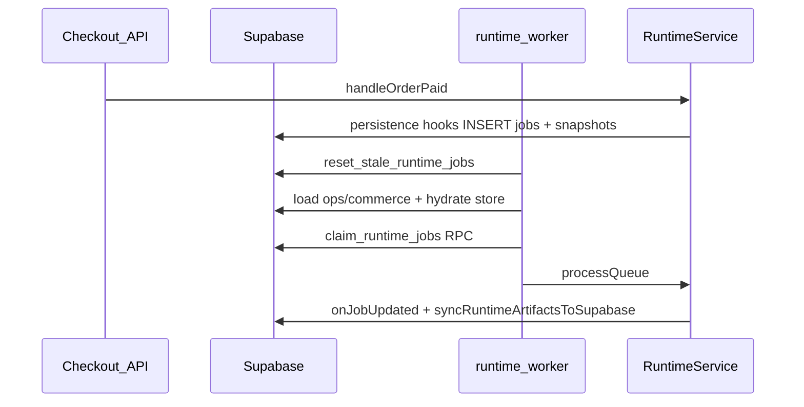

# Phase 13 — Supabase-backed runtime worker persistence

**Branch:** `cursor/phase-13-supabase-worker-persistence-4e75`  
**Builds on:** Phase 12 Runtime 2.0 (merged via PR #30)

## Problem solved

Phase 12 worker was memory-first: jobs enqueued at checkout lived only in process memory until an optional post-run sync. Worker restart lost queue state and ops/commerce data.

Phase 13 makes the worker **Supabase-authoritative** when `USE_SUPABASE=1`.

## Architecture

## New migration

[`supabase/migrations/20260819100000_runtime_worker_persistence.sql`](../supabase/migrations/20260819100000_runtime_worker_persistence.sql)

- `runtime_execution_snapshots` — JSON snapshots for in-flight workflows
- `claim_runtime_jobs(org_id, limit)` — `FOR UPDATE SKIP LOCKED` claim
- `reset_stale_runtime_jobs(org_id, minutes)` — recover crashed workers

## Key modules

| Module | Path |
|--------|------|
| Supabase load/claim/sync | `packages/operations-server/src/runtime-supabase.ts` |
| Persistence hooks | `packages/operations-server/src/runtime-persistence.ts` |
| Worker orchestrator | `packages/operations-server/src/runtime-worker.ts` |
| Runtime hooks | `packages/runtime/src/runtime-service.ts` |
| Cron entrypoint | `scripts/cron/runtime-worker.ts` |

## Environment variables

| Variable | Required | Purpose |
|----------|----------|---------|
| `USE_SUPABASE=1` | Production | Enable Supabase worker path |
| `SUPABASE_URL` / `NEXT_PUBLIC_SUPABASE_URL` | Yes | Project URL |
| `SUPABASE_SERVICE_ROLE_KEY` | Yes | Service role (bypasses RLS) |
| `RUNTIME_ORG_ID` | Yes | Tenant UUID/slug id to process |

Demo mode (unset `USE_SUPABASE`) unchanged for local dev.

## Staging runbook

1. Apply migrations through `20260819100000_runtime_worker_persistence.sql`
2. Schedule cron: `USE_SUPABASE=1 RUNTIME_ORG_ID=<uuid> pnpm runtime:worker` every 1–5 min
3. Place test order; verify row in `runtime_jobs` with status progressing to `completed`
4. Restart worker mid-queue; confirm jobs resume from Supabase (not lost)
5. Monitor `runtime_execution_snapshots`, `runtime_dead_letters`, `notification_outbox`

## Out of scope (Phase 13+)

- Real email/WhatsApp delivery
- DLQ replay UI
- DB-driven workflow definitions
- Multi-org worker loop in one invocation

## Success criteria

1. Worker restart does not lose queued jobs
2. `workflow_runner` jobs survive restart via execution snapshots
3. Ops/commerce loaded from Supabase before action handlers run
4. Demo mode unchanged
