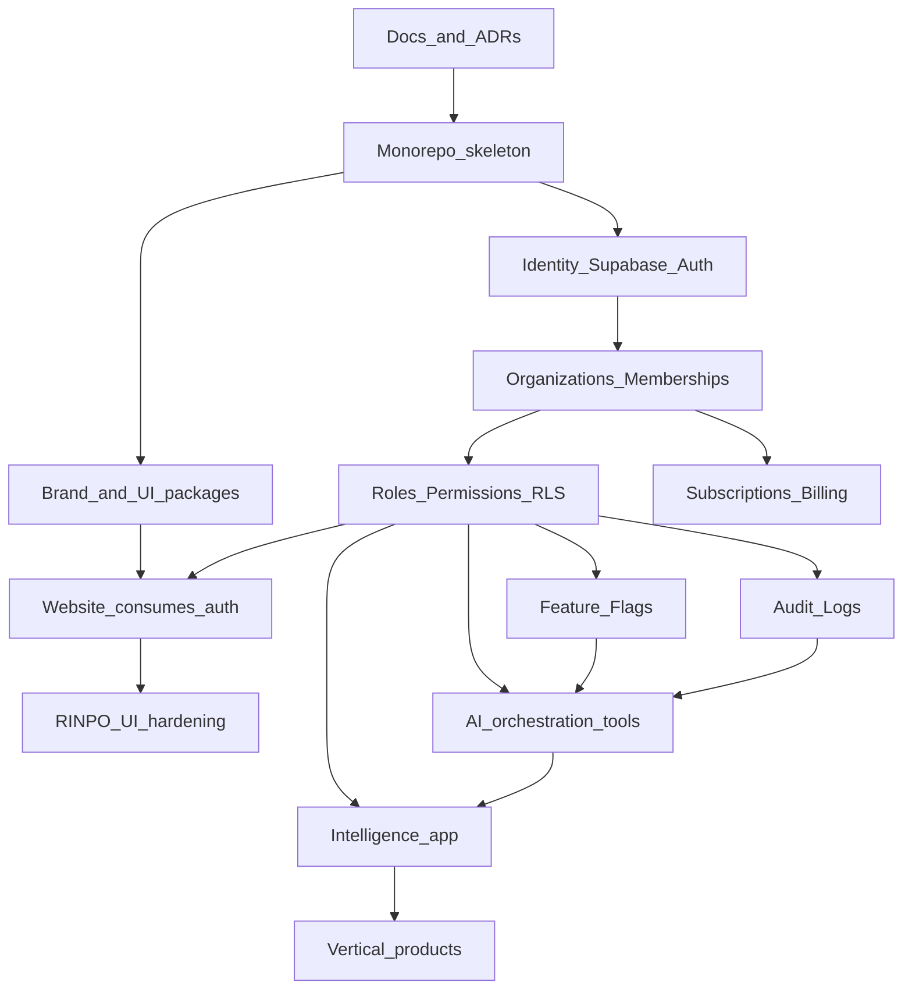

# Dependency Graph & Blockers

**Date:** 2026-08-13

---

## Build order (required)

---

## What must be built first

1. **ADRs approved** (architecture boundaries)
2. **Monorepo skeleton** without breaking website deploy
3. **Brand + UI packages** (tokens, Figtree, logo, base components)
4. **Identity** (Supabase Auth) replacing demo localStorage auth
5. **Organizations + memberships**
6. **RBAC + RLS**
7. **Audit logs + feature flags**
8. **RINPO** wired to permissioned tools (not before)
9. **Intelligence** dashboards on real data
10. **Verticals** (RINAGLOW, CRM modules, etc.)

---

## Blockers

| Blocker | Blocks | Notes |
|---------|--------|-------|
| Unresolved ADRs | All BUILD work | Founder authority |
| Demo auth still “real” looking | Any portal data | P0 security |
| No org model | RLS, billing, Intelligence | CORE foundation |
| No permission model | AI tools, admin, client data | Constitution §32 |
| No audit log | AI execute path | Constitution §33 |
| No design system package | Multi-app UI consistency | Duplication risk |
| Premature vertical build | Architecture debt | Violates §50 |

---

## Parallelizable after monorepo

- Asset library curation (`assets/rinpo/master/`)
- SEO improvements on website (RSC, sitemap) — no CORE dependency
- CI pipeline for website
- Documentation / SOPs

These must not unblock skipping identity/RLS for data products.
