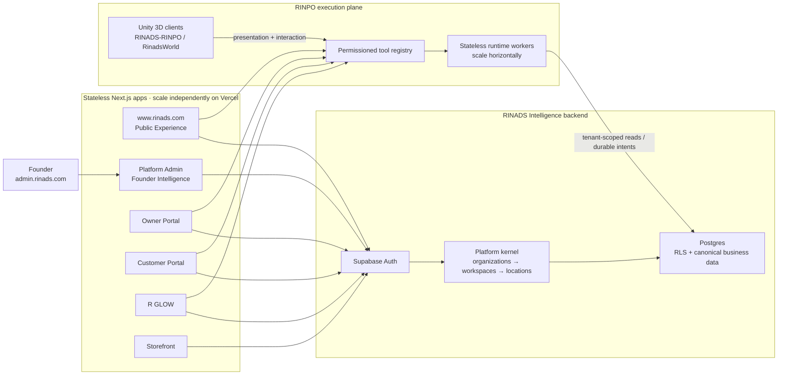

# Founder Intelligence control centre

## Placement and access

Founder Intelligence lives at `/founder-intelligence` in `apps/platform-admin`.
That app is the existing RINADS control plane at `admin.rinads.com`, already
owns platform-wide tenant administration, and already resolves the canonical
Supabase session and tenancy context. A new app would duplicate those security
boundaries and deployment credentials.

The route has its own server layout and accepts only the existing system roles:

- `founder`
- `super_admin` (the current platform-owner role)

Middleware requires a valid Supabase session first. The server layout then
checks canonical membership and role data before rendering. UI visibility is
not treated as authorization. Production continues to fail closed when demo
auth or demo data is enabled.

## Runtime map

## Scaling and trust boundaries

- **Next.js apps:** remain stateless and independently deployable. Vercel
  production deployments can scale per app without creating another source of
  business truth.
- **Supabase:** PostgreSQL is the durable authority. Organization RLS remains
  the security boundary; workspaces and locations are subordinate scopes.
  Connection, compute, storage, and Auth limits must be monitored against the
  selected Supabase plan rather than inferred in this dashboard.
- **RINPO runtime:** permissioned, idempotent workers can scale horizontally.
  Workers use tenant context and durable runtime records; RINPO never bypasses
  RBAC/RLS or receives unrestricted model-to-database access.
- **Unity:** `RINADS-RINPO` and `RinadsWorld` are client/presentation repos, not
  authoritative data stores.

RINPO's product promise applies here: the dashboard reports direct source
responses and canonical rows only. It does not forecast, synthesize, or invent
health percentages.

## Status adapters

| Source | Adapter | Operational means | Not connected when |
| --- | --- | --- | --- |
| Supabase | Auth health + PostgREST root | Both configured endpoints return success | Public project URL or anon key is absent |
| Workspace registry | Service-role query of `workspaces`, organizations, and location counts | Canonical query succeeds | Service role credentials are absent |
| Vercel | Latest production deployment per configured project | Every configured project reports `READY` | Read token or project IDs are absent |
| RINPO runtime | Configured HTTP health endpoint | Endpoint returns 2xx | No runtime health URL is configured |

Timeouts and non-2xx responses become `degraded` or `unavailable`; they never
become guessed values. Secrets are read server-side from environment variables
only.

## External runtime boundaries

The phone/business runtime is maintained separately in
`rinads-india/rinads-rinpo-AI-Native-Business-Communication-OS`. Unity work is
maintained in `RINADS-RINPO` and `RinadsWorld`. This monorepo currently exposes
no common health contract for those repositories, so Founder Intelligence
defines a minimal HTTP adapter through `RINPO_RUNTIME_HEALTH_URL`. Until the
runtime supplies that endpoint, the UI intentionally reports **Not connected**.
